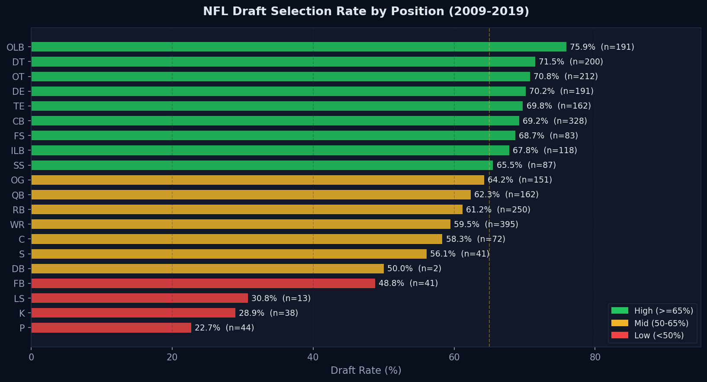
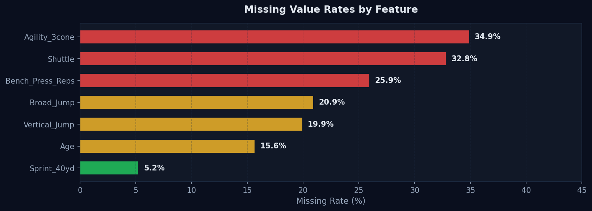
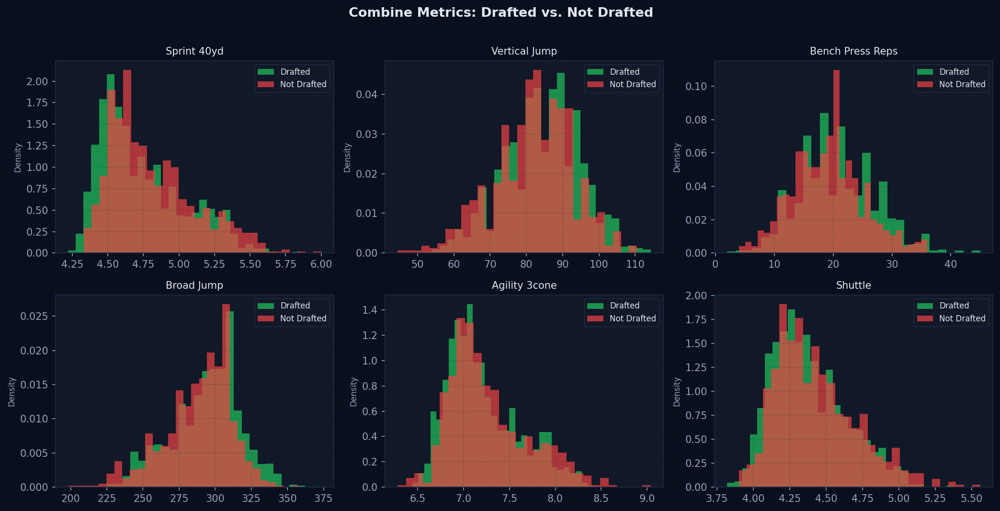
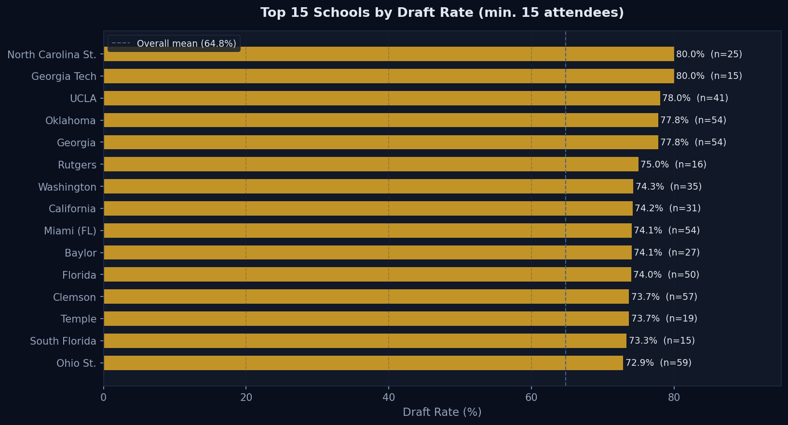
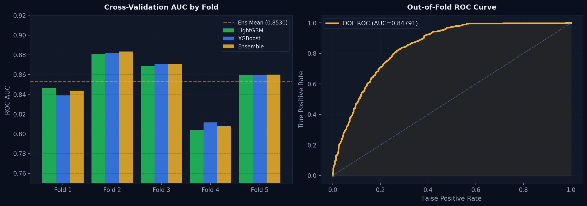
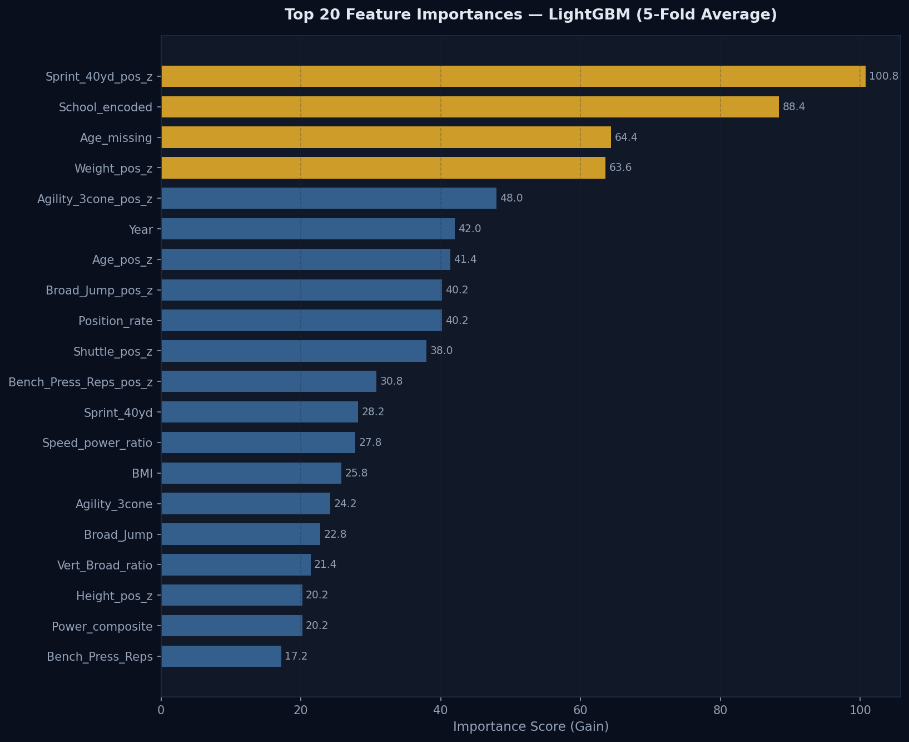

# NFL Draft Combine Predictor

> **GCI World 2026 April · In-Class Competition**
> Predicting NFL Draft selection probability from NFL Combine performance metrics using an optimised LightGBM + XGBoost ensemble.

---

## Interactive Dashboards

| Dashboard | Description |
|---|---|
| [EDA Dashboard](images/dashboard_eda.html) | Draft rates by position, missing value analysis, year trends, school rankings, feature importance |
| [Model Performance Dashboard](images/dashboard_model.html) | Ensemble architecture, CV fold results, ROC curve, hyperparameters, submission history |

Both dashboards feature entrance animations, scroll-reveal chart animations, hover tooltips, and cross-navigation links. Open either HTML file in any browser.

---

## Overview

Every year, hundreds of college football athletes attend the NFL Scouting Combine — a week-long showcase where they perform standardised physical and athletic drills in front of NFL scouts and coaches. The data generated (sprint times, vertical jumps, agility scores, bench press repetitions) feeds directly into draft decisions.

This project builds a machine learning pipeline that predicts the probability that a combine attendee will be selected in the NFL Draft, using data from the 2009–2019 combine seasons.

**Competition:** GCI World 2026 April In-Class Competition, hosted on Omnicampus by the Matsuo-Iwasawa Laboratory, University of Tokyo.
**Public Leaderboard AUC:** 0.82983 · **Username:** 26UNN_Tosayoname

---

## EDA Highlights

### Draft Rate by Position



OLBs lead with 75.9% while Punters sit at 22.7% — a 53-point gap. Position alone is a strong prior for draft probability, captured in the `Position_rate` encoding feature.

### Missing Value Analysis



Agility and shuttle drills have the highest missingness (35% and 33%). Critically, the binary flag `Age_missing` ranks **#3 in feature importance** — above every raw performance metric — proving that absence of data is itself a meaningful signal.

### Combine Metrics: Drafted vs. Not Drafted



Drafted athletes are consistently faster, more explosive, and stronger. However, the differences are subtle — raw metric gaps are small, which is why position-normalised z-scores provide much stronger signal.

### Top Schools by Draft Rate



Georgia Tech, NC State, UCLA, Georgia, and Oklahoma all produce 77–80% draft rates (minimum 15 combine attendees). The smoothed school target encoding (k=10) captures this signal without overfitting to small schools.

---

## Model Performance

### Cross-Validation Results



5-Fold Stratified CV on training data. The OOF ROC curve (right) shows an aggregate AUC of approximately 0.852, confirming the ensemble generalises well across held-out splits.

| Fold | LightGBM AUC | XGBoost AUC | Ensemble AUC |
|---|---|---|---|
| 1 | 0.84625 | 0.83897 | 0.84379 |
| 2 | **0.88070** | **0.88154** | **0.88333** |
| 3 | 0.86884 | 0.87079 | 0.87043 |
| 4 | 0.80356 | 0.81144 | 0.80744 |
| 5 | 0.85935 | 0.85955 | 0.85985 |
| **Mean** | **0.85174** | **0.85246** | **0.85297** |
| **Std** | **0.02726** | **0.02395** | **0.02582** |

### Feature Importance



The top 5 features reveal the model's core logic: (1) position-relative sprint speed, (2) school prestige, (3) missing age flag, (4) position-relative weight, (5) position-relative agility.

---

## Methodology

### Feature Engineering Pipeline

All statistics (group means, encoding rates, z-score parameters) are computed exclusively from training data and applied to the test set. No data leakage.

```
Raw Data (15 features)
       ↓
Missing value flags (7 binary indicators added)
       ↓
Position-wise group mean imputation
       ↓
Smoothed school target encoding (k=10)
       ↓
Draft-rate encodings (Position, Position_Type, Player_Type)
       ↓
Physical composites (BMI, Power, Agility, Speed-Power ratio)
       ↓
Position-normalised z-scores (9 metrics)
       ↓
33 engineered features
```

**Key features engineered:**

| Feature | Type | Description |
|---|---|---|
| `Sprint_40yd_pos_z` | Z-score | 40-yard dash relative to position group mean |
| `School_encoded` | Target enc. | Smoothed school draft rate (k=10 prior) |
| `Age_missing` | Binary flag | Whether age was not reported |
| `Weight_pos_z` | Z-score | Weight relative to position group |
| `Position_rate` | Rate enc. | Historical draft rate for this position |
| `BMI` | Composite | Weight / Height² |
| `Power_composite` | Composite | Vertical + Broad/10 + Bench reps |
| `Speed_power_ratio` | Composite | Broad Jump / Sprint time |

### Ensemble Architecture

```
Final Prediction = 0.60 × LightGBM + 0.40 × XGBoost
```

Both models trained with 5-fold stratified cross-validation. Test predictions are averaged across all 5 folds (10 models total).

**LightGBM** (Optuna-tuned, 100 trials):

| Parameter | Value |
|---|---|
| n_estimators | 2000 |
| learning_rate | 0.0554 |
| num_leaves | 100 |
| max_depth | 3 |
| min_child_samples | 16 |
| subsample | 0.755 |
| colsample_bytree | 0.709 |
| reg_alpha | 0.00360 |
| reg_lambda | 0.03855 |

**XGBoost:**

| Parameter | Value |
|---|---|
| n_estimators | 1000 |
| learning_rate | 0.05 |
| max_depth | 4 |
| subsample | 0.80 |
| colsample_bytree | 0.80 |
| early_stopping_rounds | 100 |

---

## Dataset

| File | Rows | Description |
|---|---|---|
| `data/train.csv` | 2,781 | Athletes with known draft outcome |
| `data/test.csv` | 696 | Athletes for prediction |
| `data/sample_submission.csv` | 696 | Submission format template |

**Target distribution:** 65.0% drafted, 35.0% not drafted.

**Missing value rates:**

| Feature | Missing Rate |
|---|---|
| Agility_3cone | 34.9% |
| Shuttle | 32.8% |
| Bench_Press_Reps | 25.9% |
| Broad_Jump | 20.9% |
| Vertical_Jump | 19.9% |
| Age | 15.6% |
| Sprint_40yd | 5.2% |

---

## Submission History

| # | File | Public AUC | Key Change |
|---|---|---|---|
| 1 | `submission.csv` | **0.82983** | LGB+XGB · 33 features · 5-fold · Optuna |
| 2 | `submission_1.csv` | 0.82736 | 49 features — CV improved but leaderboard dropped (overfit) |
| 3 | `submission_2.csv` | 0.82801 | 36 features · 10-fold · stronger regularisation |

**Best public score: 0.82983** (submission.csv)

---

## Repository Structure

```
NFL-draft-combine-predictor/
├── README.md
├── requirements.txt
├── .gitignore
├── notebooks/
│   └── nfl_draft_predictor.ipynb     — full competition notebook
├── data/
│   ├── train.csv                     — training data (2,781 athletes)
│   ├── test.csv                      — test data (696 athletes)
│   └── sample_submission.csv         — submission format
├── outputs/
│   └── submission.csv                — best submission (AUC 0.82983)
├── images/
│   ├── dashboard_eda.html            — interactive EDA dashboard
│   ├── dashboard_model.html          — interactive model performance dashboard
│   ├── draft_rate_by_position.png
│   ├── missing_values.png
│   ├── metrics_distribution.png
│   ├── top_schools.png
│   ├── cv_performance.png
│   └── feature_importance.png
└── src/
    └── feature_engineering.py        — reusable, documented pipeline module
```

---

## How to Run

**1. Clone the repository**

```bash
git clone https://github.com/Tosa9/NFL-draft-combine-predictor.git
cd NFL-draft-combine-predictor
```

**2. Install dependencies**

```bash
pip install -r requirements.txt
```

**3. Run on Google Colab (recommended)**

Open `notebooks/nfl_draft_predictor.ipynb` in Google Colab. Upload the `data/` folder to Google Drive, update the `PATH` cell to match your Drive directory, and run all cells.

**4. Generate submission**

The final cell saves `submission.csv` inside the `data/` folder, ready for upload to Omnicampus.

---

## Key Findings

1. **Position-relative speed matters more than raw speed.** `Sprint_40yd_pos_z` ranks #1, outranking raw `Sprint_40yd` by 4x in importance.

2. **School prestige carries measurable signal.** Georgia, Oklahoma, Clemson, Ohio St. all produce 73–80% draft rates vs the 65% overall average.

3. **Missing data is informative.** `Age_missing` ranks #3, above all raw performance metrics. Absence of a data point is itself a predictor.

4. **Position creates a strong prior.** A 53-point draft rate gap between OLBs and Punters makes position the strongest categorical signal.

5. **Simpler models generalise better on small datasets.** Adding 16 more features improved CV AUC by 0.005 but hurt the public leaderboard by 0.002.

---

## Author

**Omokhoa Oshose Tosayoname (Tosa)**
Mechanical Engineering Graduate, University of Nigeria, Nsukka.
SPE Member · Junior Project Manager · AI/ML Trainee, GCI Global 2026.

- GitHub: [github.com/Tosa9](https://github.com/Tosa9)
- LinkedIn: [linkedin.com/in/oshose-omokhoa-3982aa364](https://linkedin.com/in/oshose-omokhoa-3982aa364)
- Twitter/X: [@Tosa_omokhoa](https://twitter.com/Tosa_omokhoa)

---

## License

This project is for educational and competition purposes. Data sourced from GCI World 2026 April competition materials, Matsuo-Iwasawa Laboratory, University of Tokyo.
